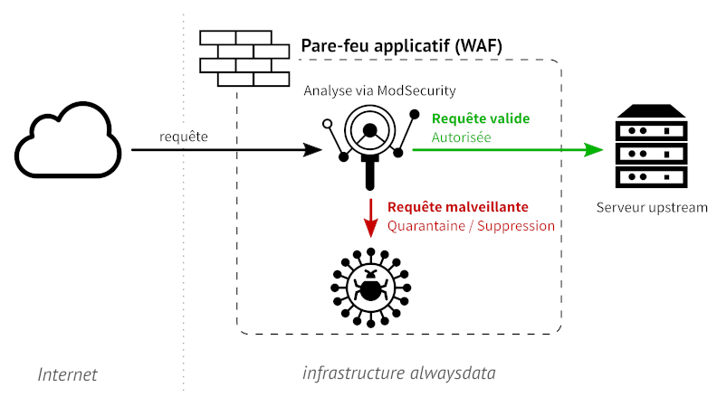
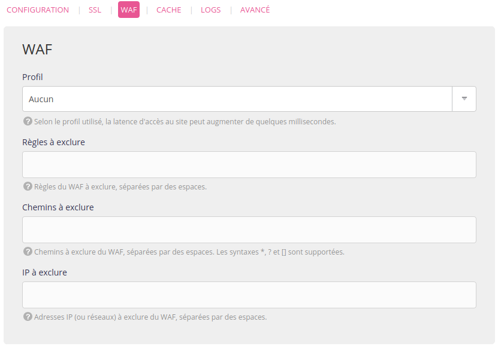

Un [WAF](https://fr.wikipedia.org/wiki/Web_application_firewall) exa­mine chaque requête HTTP pour protéger les applications web face à différents vecteurs d'attaques pour minimiser les infections. Il peut les auto­ri­ser à tran­si­ter jus­qu’à l’ap­pli­ca­tion, ou les blo­quer, aler­ter, consi­gner si elles sont jugées mal­veillantes.



alwaysdata utilise le WAF ModSecurity et l'ensemble de règles libres [OWASP Modsecurity Core Rule Set](https://coreruleset.org/) (CRS).

## Paramétrer le pare-feu applicatif web

Cela se passe sur l'interface d'administration dans **Web > Sites > Modifier le [site] - ⚙️ > WAF**.


### Profils disponibles

|Profil|Description|
|---|---|
|Aucun|(par défaut)|
|Basique|Respect strict du pro­to­cole HTTP|
||Détection de robots mal­veillants|
|Fort|L’ensemble des règles du pro­fil basique|
||Détection d’exécution de code à dis­tance (RCE)|
||Détection d’attaque type [Cross-Site Scripting (XSS)](https://fr.wikipedia.org/wiki/Cross-site_scripting)|
||Détection d’[injec­tion SQL](https://fr.wikipedia.org/wiki/Injection_SQL)|
| Complet|L’ensemble des règles du pro­fil fort|
||Détection d’attaques rela­tives au lan­gage PHP|
||Détection d’attaque par inclu­sion de fichier local (LFI)|
||Détection d’attaque par [inclu­sion de fichier dis­tant (RFI)](https://fr.wikipedia.org/wiki/Remote_File_Inclusion)|
|WordPress|L’ensemble des règles du pro­fil com­plet|
||Règles spé­ci­fiques à WordPress|
|Drupal|L’ensemble des règles du pro­fil com­plet|
||Règles spé­ci­fiques à Drupal|
|Nextcloud|L’ensemble des règles du pro­fil com­plet|
||Règles spé­ci­fiques à Nextcloud|
|Dokuwiki|L’ensemble des règles du pro­fil com­plet|
||Règles spé­ci­fiques à Dokuwiki|

> [!NOTE]
> L’ac­ti­va­tion d’un pro­fil de pro­tec­tion va se tra­duire par une légère aug­men­ta­tion de la latence lors du trai­te­ment d’une requête HTTP. Cette latence, de l’ordre de quelques mil­li­se­condes, aug­mente avec le degré de pro­tec­tion.


### Exclure des règles

Selon votre cas d'utilisation, le **comportement du WAF peut être trop restrictif**. Il est aussi possible qu'il génère de **faux positifs** lors de son analyse. Si vous jugez que son comportement n'est pas approprié, vous avez la possibilité d'exclure certaines règles utilisées lors de l'analyse.

Seul le **numéro de la règle à exclure** doit être spécifié. Vous le retrouverez dans les logs Sites (`/home/[compte]/admin/logs/sites`). Exemple :

```
[08/Jan/2019:11:09:19 +0100] [waf] - <IP attaquante> "GET /?param=%22><script>alert(1);</script> HTTP/1.1" - 941100 | XSS Attack Detected via libinjection' with value: "><script>alert(1);</script>
[08/Jan/2019:11:09:19 +0100] [waf] - <IP attaquante> "GET /?param=%22><script>alert(1);</script> HTTP/1.1" - 941110 | XSS Filter - Category 1: Script Tag Vector' with value: <script>
[08/Jan/2019:11:09:19 +0100] [waf] - <IP attaquante> "GET /?param=%22><script>alert(1);</script> HTTP/1.1" - 941160 | NoScript XSS InjectionChecker: HTML Injection' with value: <script>
```

Ce serait donc `941100`, `941110` et `941160` qui pourraient être indiqués.

> [!WARNING] Attention
> Il faut veiller à ajouter progressivement des règles car l'exclusion est applicable sur tout le site. En effet, même si ajouter un grand nombre de règles à exclure peut améliorer la navigation dans certains cas, la protection sera alors amoindrie dans tous les autres cas.


### Exclure des chemins

Ce type d'exclusion permet d'**éviter l'analyse de pages commençant par le chemin spécifié**. En saisissant `/foo/` par exemple, `www.mon-site.com/foo/` sera exclu de l'analyse tout comme les query strings : `www.mon-site.com/foo/?param=bar`. Pour exclure aussi `www.mon-site.com/foo/bar` et `www.mon-site.com/foo/script.php`, il faut rajouter un _wildcard_ : `/foo/*`. Enfin, si on veut substituer un caractère quelconque (notamment qui changerait régulièrement), `?` peut être utilisé.

Donc, pour écarter de l'analyse `www.mon-site.com/foo/barBaz/`, `foo` et `Baz` étant des _strings_ quelconques, le chemin à exclure serait : `/*/bar?/`.

> [!TIP] Astuce
> Prenons le cas d'un site de type WordPress qui présente des logs similaires à ceux présentés précédemment. Si ces règles sont déclenchées lors de la navigation dans l'interface d'administration du blog, alors il est possible de les exclure de manière permanente.
> Cependant, le blog en lui-même ne sera plus protégé contre ces tentatives d'attaques. Dans ce cas, il est plus judicieux d'exclure le chemin (exemple : /wp-admin/*) pour que toutes vos opérations sur l'interface d'administration ne soient plus concernées par l'analyse du WAF.


Les *[query strings](https://en.wikipedia.org/wiki/Query_string)* ne peuvent pas être utilisées dans ces exclusions.

### Exclure des IP

Il peut être intéressant d'exclure des **IP sûres** (IP spécifiques ou plages d'IP) pour éviter à des outils ou des personnes d'être bloqués.

Prenons l'exemple de [WPScan](https://wpscan.com/) : en l'activant sur un site WordPress certaines des requêtes qu'il effectue peuvent être bloquées. Exclure des règles ou des chemins ne serait pas efficace comme il observe de nombreuses URLs. La solution est donc d'exclure le serveur HTTP sur lequel est installé WPScan pour qu'il puisse fonctionner normalement.

> Icônes : The Noun Project
