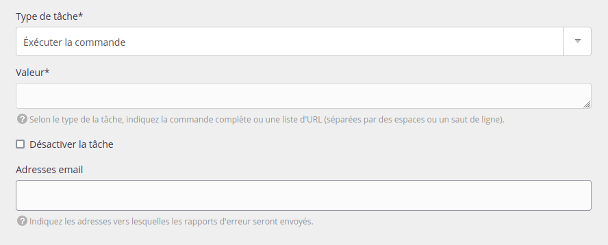
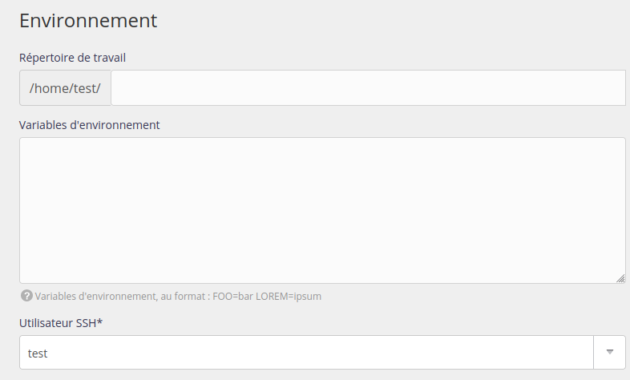
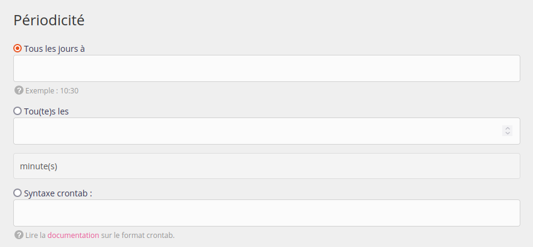

Les Web apps ou services ont parfois besoin d’exécuter des tâches périodiquement, exécuter des commandes ou appeler des URLs, sans aucune interaction utilisateur. Pour ce faire, vous devez créer une tâche planifiée.

Notre plateforme s’appuie sur [Debian](https://www.debian.org/) et sa [crontab](https://fr.wikipedia.org/wiki/Cron) mais permet de les gérer directement dans notre [interface d'administration](https://admin.alwaysdata.com) - onglet **Avancé > Tâches planifiées** - et de faciliter l'utilisation.

Plusieurs types d’informations sont à fournir :

- la (les) commande(s) que vous souhaitez exécuter, ou les URLs que vous souhaitez requêter. Des adresses email peuvent aussi être renseignées pour recevoir les rapports d'erreurs[^1] (séparées par un espace).



- l'environnement SSH



- la périodicité de votre tâche : vous pouvez spécifiez une heure fixe, ou un intervalle



- [Référence API](https://api.alwaysdata.com/v1/job/doc/)

## Utiliser les tâches planifiées

- Si la tâche est programmée à une certaine fréquence, mais que l'exécution de la tâche précédente n'est pas terminée, l'actuelle sera ignorée ;
- Les tâches sont démarrées dans la minute indiquée. Autrement dit, une tâche devant débuter tous les jours à 6h30, démarrera entre 6:30:00 et 6:30:59 ;
- Un log est automatiquement créé et disponible dans le répertoire `/home/[compte]/admin/logs/jobs/`. Il vous donne le démarrage et l'arrêt de la tâche.
	- Un extrait de ces logs est présenté dans l'interface d'administration alwaysdata (**Logs** - 📄) ;
	- les adresses email renseignées pour recevoir les rapports d'erreurs ne remplacent pas ces logs ;
- Les processus en cours sont accessible via le menu **Avancé > Processus > Tâches planifiées** ;
- Pour les tâches de type *Commande*, les versions de langages utilisées par défaut sont celles renseignées dans le menu **Environnement** de l'interface d'administration. Il est possible de choisir une autre version en utilisant les *Variables d'environnement*.
	
> [!NOTE]
> Si votre script a besoin d'autoriser certaines IP, autorisez ces [plages d'adresses IP](/fr/docs/caracteristiques-techniques/plages-dip/).

	
Utilisateurs du [Cloud Public](/fr/docs/admin-facturation/facturation/prix-cloud-public/) :

- La consommation doit rester raisonnable. Si la tâche planifiée est un traitement lourd, il convient de diminuer la fréquence.


Utilisateurs du [Cloud Privé](/fr/docs/admin-facturation/facturation/prix-cloud-prive/) :

- Même si c'est contre-indiqué, l'accès à la commande `crontab -e` est aussi disponible. Les deux systèmes sont distincts.

## Problèmes fréquents

- `source venv/bin/activate && python` est spécifique à [Bash](https://fr.wikipedia.org/wiki/Bourne-Again_shell) et ne peut fonctionner. À remplacer par `venv/bin/python` ;
- les raccourcis en **@** - exemples _@hourly_ ou _@reboot_ - ne sont pas acceptés (syntaxe non-normalisée) ;
- Elles utilisent les versions de langages par défaut des comptes (définies dans **Environnement**). Pour en utiliser d'autres, indiquez-les dans le champ *Variables d'environnement*.

## Exemples

### WordPress

Lancement, toutes les dix minutes, de l'outil [WordPress](https://developer.wordpress.org/cli/commands/cron/event/run/) pour exécuter leurs tâches planifiées :

Interface d'administration alwaysdata :

- _valeur_ : `php /home/[compte]/wordpress/htdocs/wp cron event run --due-now`
- _fréquence_ : deuxième choix - Toutes les 10 minutes

Syntaxe crontab équivalente :

```
*/10 * * * * php /home/[compte]/wordpress/htdocs/wp cron event run --due-now
```

### tt-rss

[Rafraîchissement d'un backend RSS](https://git.tt-rss.org/fox/tt-rss.wiki.git/tree/UpdatingFeeds.md#n58) avec TT-rss, tous les jours à 10:30 :

Interface d'administration alwaysdata :

- _valeur_ : `php /home/[compte]/tt-rss/update.php --feeds --quiet`
- _fréquence_ : premier choix - Tous les jours à 10:30

Syntaxe crontab équivalente :

```
30 10 * * * php /home/[compte]/tt-rss/update.php --feeds --quiet
```

[^1]: Un rapport est envoyé lorsque le code de retour est différent de 0. Si le tâche n'est pas exécutée, aucun mail n'est envoyé.
